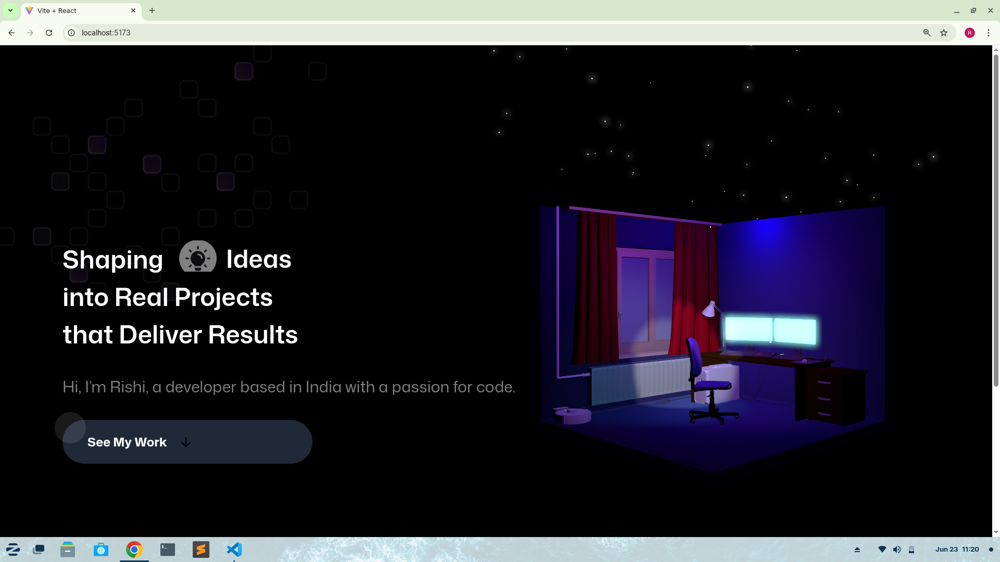

# 🌐 3D Developer Portfolio - React + Vite

Welcome to my **3D Developer Portfolio** built using **React**, **Vite**, and **Three.js** (via `@react-three/fiber`). This project showcases my skills, experience, and work in a modern, interactive way, featuring smooth 3D animations, responsive design, and clean UI.

---

## 🚀 Features

- 🎮 3D model viewer using `@react-three/fiber` and `@react-three/drei`
- ⚡ Fast bundling and dev experience with Vite
- 🖥️ Responsive design optimized for all screen sizes
- 🎨 Modern UI/UX with Tailwind CSS
- 🧑‍💻 Dynamic sections: About, Experience, Projects, Contact

---

## 📸 Screenshots

| Home Section | About Section | Contact Form |
|--------------|----------------|--------------|
|  |  |  |

> 💡 Make sure to place your screenshots in the `screenshots/` folder.

---

## 🛠️ Tech Stack

- **React.js** – UI library  
- **Vite** – Fast bundler  
- **Three.js** via `@react-three/fiber` – 3D rendering  
- **Tailwind CSS** – Styling  
- **EmailJS** – Contact form integration  
- **Framer Motion** – Smooth animations  

---

## ⚙️ Getting Started

### 1. Clone the Repository

```bash
git clone https://github.com/rishikannaaa/3d-portfolio-react-vite.git
cd 3d-portfolio-react-vite
